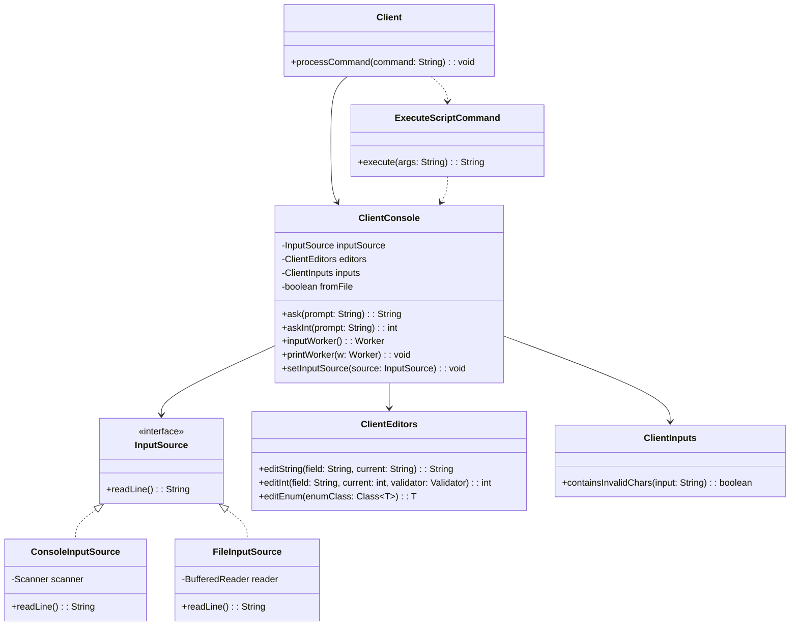

```mermaid
classDiagram
    class InputSource {
        <<interface>>
        +readLine(): String
    }

    class ConsoleInputSource {
        -Scanner scanner
        +readLine(): String
    }

    class FileInputSource {
        -BufferedReader reader
        +readLine(): String
    }

    class ClientConsole {
        -InputSource inputSource
        -ClientEditors editors
        -ClientInputs inputs
        -boolean fromFile
        +ask(prompt: String): String
        +askInt(prompt: String): int
        +inputWorker(): Worker
        +printWorker(w: Worker): void
        +setInputSource(source: InputSource): void
    }

    class ClientEditors {
        +editString(field: String, current: String): String
        +editInt(field: String, current: int, validator: Validator): int
        +editEnum(enumClass: Class~T~): T
    }

    class ClientInputs {
        +containsInvalidChars(input: String): boolean
    }

    class Client {
        +processCommand(command: String): void
    }

    class ExecuteScriptCommand {
        +execute(args: String): String
    }

    InputSource <|.. ConsoleInputSource
    InputSource <|.. FileInputSource
    ClientConsole --> InputSource
    ClientConsole --> ClientEditors
    ClientConsole --> ClientInputs
    Client --> ClientConsole
    Client ..> ExecuteScriptCommand
    ExecuteScriptCommand ..> ClientConsole
```